##iOS直播架构  
###一、简介  
###1.1.开始
网络上有很多直播相关技术介绍，零零碎碎挺多，本着去研究的态度及在开发中踩过的坑做下总结。直播技术对软件开发人员技术要求还是相当高的，在直播中运用到的技术难点非常之多，视频/音频处理，图形处理，视频/音频压缩，CDN分发，即时通讯等技术，个人开发还是比较困难的。当然自己在研究过程中，只研究了音视频捕获、编码、封装FLV、RTMP推流等，当下各个领域都有大神封装出了各种牛逼的框架，我也只是站在大神的肩膀上，研究相对容易很多。
###1.2.直播APP架构
简单原理：采集端将采集到的音视频数据通过推流地址推送到服务器，播放端通过拉流地址将音视频数据拉到本地播放
###1.2.1.主要功能
采集端（主播）:

* 音频采集  
* 视频采集  
* 音频编码压缩
* 视频编码压缩
* 音视频封装成FLV，TS文件
* 数据流推送

服务器:

* 数据分布CDN
* 鉴黄：鉴黄师
* 截屏：显示主播画面
* 录制视频
* 实时转码

播放端:

* 从FLV，TS中分离音视频数据
* 音视频解码
* 播放
* IM 聊天互动

###1.2.2.主要技术
采集端:

* AVFoundation框架：数据采集
* GPUImage框架：美颜处理
* 系统AudioToolbox、VideoToolbox框架：音视频硬编码压缩
* libfaac、libx264框架：编码压缩
* librtmp框架：推流

服务端:

* SNS
* BMS
* nginx + rtmp 模块

播放端:

* ijkplayer框架：音视频播放（出处：B站）
* FFmpeg框架：音视频jeima
* VideoToolbox框架：视频硬解码
* AudioToolbox框架：音频硬解码

推流:

* RTMP

拉流:

* RTMP
* HLS
* HTTP-FLV

###1.2.3.直播app技术点
####1.2.3.1.技术点架构图：
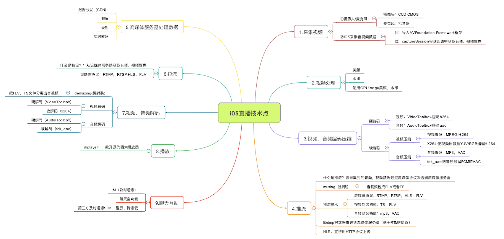
####1.2.3.2.客户端-服务端架构图：
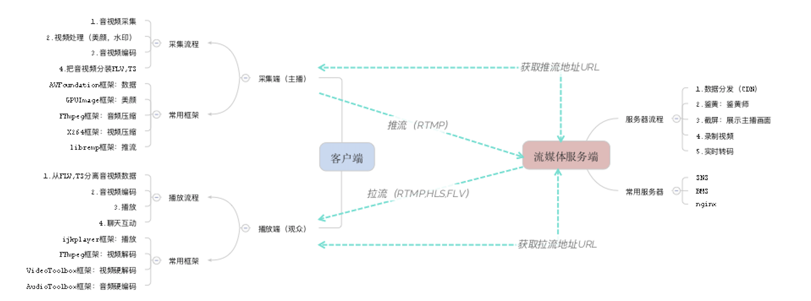

###二、相关知识点
###2.1.涉及到的概念
###2.1.1.CMSampleBufferRef介绍
ios中表示一帧音频或视频数据，包含了这一帧数据的内容和格式。  
(1)代表视频的CMSampleBufferRef中保存的数据是yuv420格式的视频帧(因为我们在视频输出设置中将输出格式设为：kCVPixelFormatType_420YpCbCr8BiPlanarVideoRange)。  
(2)代表音频的CMSampleBufferRef中保存的数据是PCM格式的音频帧。
###2.1.2.yuv概念
yuv是一种图片储存格式，跟RGB格式类似。  
yuv中，y表示亮度，单独只有y数据就可以形成一张图片，只不过这张图片是灰色的。u和v表示色差(u和v也被称为：Cb－蓝色差，Cr－红色差)。  
yuv可以通过抛弃色差来进行带宽优化：  
比如yuv420格式图像相比RGB来说，要节省一半的字节大小，抛弃相邻的色差对于人眼来说，差别不大。  
一张yuv格式的图像，占用字节数为 (width * height + (width * height) / 4 + (width * height) / 4) = (width * height) * 3 / 2。   
一张RGB格式的图像，占用字节数为（width * height） * 3。  
在传输上，yuv格式的视频也更灵活(yuv3种数据可分别传输)。  
视频编码器最初是不支持rgb格式的。但是所有的视频编码器都支持yuv格式。    
yuv420也包含不同的数据排列格式：I420，NV12，NV21.  
其格式分别如下：  
**I420格式：**y,u,v 3个部分分别存储：Y0,Y1…Yn,U0,U1…Un/2,V0,V1…Vn/2  
**NV12格式：**y和uv 2个部分分别存储：Y0,Y1…Yn,U0,V0,U1,V1…Un/2,Vn/2   
**NV21格式：**同NV12，只是U和V的顺序相反。  
设置为kCVPixelFormatType_420YpCbCr8BiPlanarVideoRange时，表示输出的视频格式为NV12；   
设置为kCVPixelFormatType_420YpCbCr8Planar时，表示使用I420。  
GPUImage设置相机输出数据时，使用的就是NV12.  
###2.1.3.PCM概念
脉冲编码调制，其实是将不规则的模拟信号转换成数字信号，这样就可以通过物理介质存储起来，而声音也是一种特定频率（20-20000HZ）的模拟信号，也可以通过这种技术转换成数字信号，从而保存下来。  
PCM格式，就是录制声音时，保存的最原始的声音数据格式。  
相信你应该听说过wav格式的音频，它其实就是给PCM数据流加上一段header数据，就成为了wav格式。  
wav格式有时候被称为无损格式，why? 它保存的是最原始pcm数据（也跟采样率和比特率有关）  
像我们耳熟能详的那些音频格式，mp3，aac等等，都是有损压缩，为了节约占用空间，在很少损失音效的基础上，进行最大程度的压缩。  
所有的音频编码器，都支持pcm编码，而且录制的声音，默认也是PCM格式。  
###2.1.4.怎么压缩视频数据呢？h264 
最重要的一点是将视频帧分为关键帧和非关键帧。  
关键帧的数据是完整的。包含了所有的颜色数据。这样的视频帧称为I帧。  
非关键帧数据不完整，但是它能够根据前面或者后面的帧数据，甚至自己的部分帧数据，将自身数据补充完整。这种视频帧被称为 B/P 帧。  
总体来说，h264跟yuv相比，最大的不同就是它是压缩的（通常此过程称为编码，不只是简单的压缩）。 

###2.1.5. H264码流 SPS、PPS
**SPS：**序列参数集(Sequence Parameter Set)  
**PPS：**图像参数集(Picture Parameter Set)  
**I帧：**完整编码的帧，也叫关键帧  
**P帧：**参考之前的I 帧生成的只包含差异部分编码的帧  
**B帧：**参考前后的帧编码的帧叫B帧  
H264采用的核心算法的帧内压缩和帧间压缩，帧内压缩是生成I帧的算法，帧间压缩是生成B帧和P帧的算法
H264原始码流是由一个接一个的NALU(Nal Unit)组成的，NALU = 开始码 + NAL类型 + 视频数据  
开始码用于标示这是一个NALU单元的开始，必须是"00 00 00 01"或"00 00 01"  
**NALU类型如下：**0 未规定，1 非IDR图像中不采用数据划分的片段，2 非IDR图像中A类数据划分片段，3 非IDR图像中B类数据划分片段，4 非IDR图像中C类数据划分片段，5 IDR图像的片段，6 补充增强信息（SEI），7 序列参数集（SPS），8 图像参数集（PPS），9 分割符，10 序列结束符，11 流结束符，12 填充数据，13 序列参数集扩展，14 带前缀的NAL单元，15 子序列参数集，16-18 保留，19 不采用数据划分的辅助编码图像片段，20 编码片段扩展，21–23 保留，24–31 未规定。  
一般我们只用到了1、5、7、8这4个类型就够了。类型为5表示这是一个I帧，I帧前面必须有SPS和PPS数据，也就是类型为7和8，类型为1表示这是一个P帧或B帧。  
**帧率：**单位为fps(frame pre second)，视频画面每秒有多少帧画面，数值越大画面越流畅  
**码率：**单位为bps(bit pre second)，视频每秒输出的数据量，数值越大画面越清晰  
**分辨率：**视频画面像素密度，例如常见的720P、1080P等  
**关键帧间隔：**每隔多久编码一个关键帧

###2.1.6.什么是硬编码？什么是软编码
使用CPU进行编码叫软编，使用硬件设备编码叫硬编

* 软编码和硬编码区别  
软编码：使用CPU进行编码。  
硬编码：不使用CPU进行编码，如使用显卡GPU，专用的DSP、FPGA、ASIC芯片等硬件进行编码，iPhone手机比较适合硬编，android手机是个坑，由于厂商不同，手机芯片也不同不适合硬编。

* 软编码和硬编码比较  
软编码：实现直接、简单，参数调整方便，升级易，但CPU负载重，性能较硬编码低，低码率下质量通常比硬编码要好点。  
硬编码：性能高，低码率下通常质量低于软编码器，但部分产品在GPU硬件平台移植了优秀的软编码算法(如x264),质量基本等同于软编码。

* 目前主流GPU加速平台  
Intel、AMD、NVIDIA

* 目前主流GPU平台开发框架  
CUDA:NVIDIA的封闭编程框架，通过框架可以调用GPU计算资源  
AMD APP:AMD为自己的GPU提出的一套通用并行编程框架，标准开发，通过在CPU、GPU同时支持OpenCL框架，进行计算力融合  
OpenCL:开放计算语音、为异构平台编写程序的框架，异构平台可包含CPU、GPU以及其他计算处理器，目标是使用相同的运算能支持不同平台硬件加速。  
Inel QuickSync:集成Intel显卡中的专用视频编解码模块 
 
###2.1.7.什么是flv
h264是视频编码格式。  
aac是音频编码格式。  
除了这两种格式之外，还有一种将视频和音频合成(muxer 这个词会在相关代码中经常出现)在一起的格式。  
比如：mp4，avi，rmvb，flv。  
flv 是一种简单的视频合成格式。  
它支持指定的音视频格式，如：h263，h264，VP6 及 AAC，MP3，Nellymoser等。  
简单说来，flv的组成如下：  
flv header + pre tag size + script tag + pre tag size + video tag + pre tag size + audio tag  + pre tag size + ... + video tag + pre tag size + audio tag + pre tag size 
flv header 内容是固定的。  
一个tag就像是一个数组中的元素。是一个单独的储存了信息的数据块。  
script tag 内存储了视频相关信息，如：宽高，码率，fps，文件大小，音频信息等等。  
video tag 中 存储的是完整的视频压缩格式的一帧数据，如h264数据。  
audio tag 中 存储的是完整的音频压缩格式的一帧数据，如 aac数据。  
这样把所有数据拼接在一起，写入文件。这个文件就是flv格式。可以使用播放器播放了。  
而flv刚好支持 h264 和 aac。 

为什么介绍flv呢？  
因为rtmp协议所传输的视频流，就要求是flv格式。  
所以，程序从相机和麦克风捕获到音视频数据后，分别转成 aac和h264格式的音视频帧。  
然后将aac和h264音视频帧合成flv格式的视频后发送到rtmp服务器。客户端就可以播放我们推的流了。

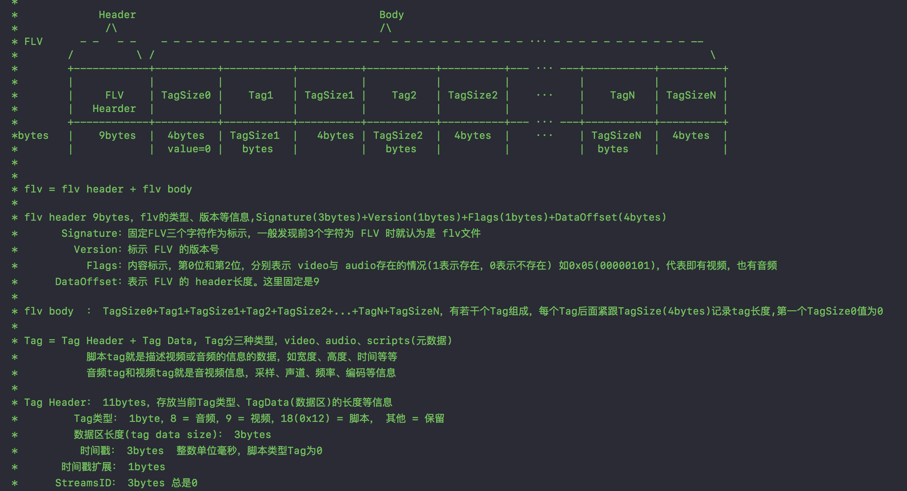
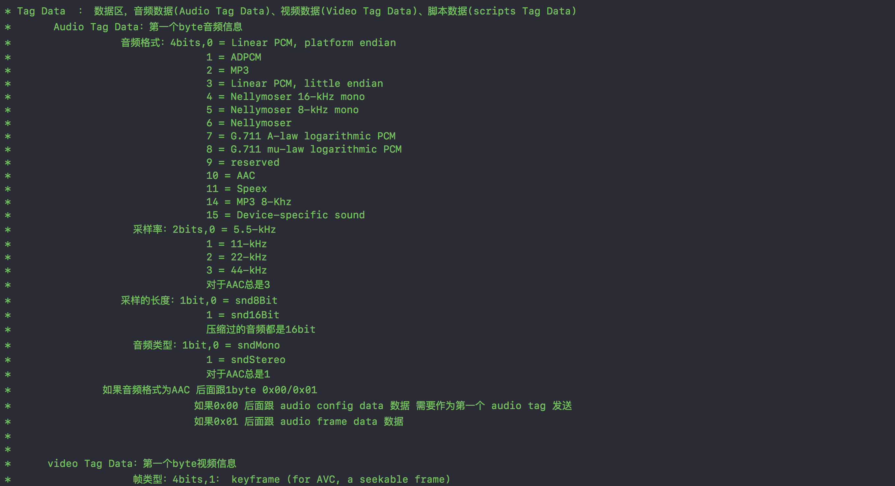
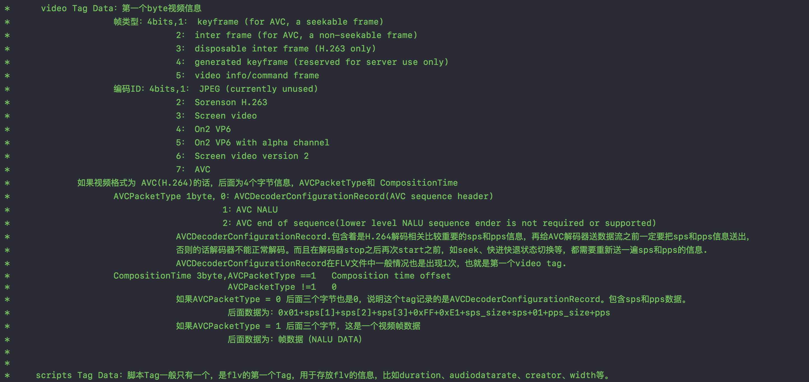
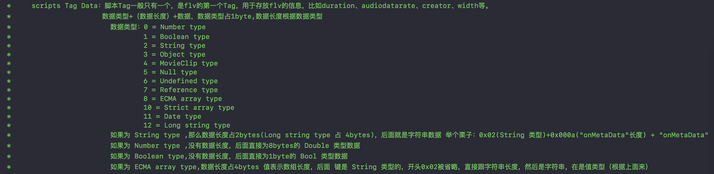

  
###2.1.8.推流流程
使用rtmp协议（其他协议也类似）推流的大体流程如下：   
1. 通过系统相机捕获视频及声音，该美颜的美颜，该滤镜的滤镜。  
2. 捕获的视频帧为yuv格式，音频帧为pcm格式。  
3. 将捕获的音视频数据，传入一个串行队列(编码队列)，在队列中进行编码操作。  
4. 将yuv格式视频数据，转成h264格式视频帧；将pcm格式音频数据，转成aac格式音频帧。  
5. 将转好的h264及aac格式数据，转成flv视频帧。放入编码缓冲区，待发送。继续获取视频帧并编码。  
6. 建立rtmp连接到服务器，成功后，创建另一个串行队列（发送队列）。  
7. rtmp协议，需要在首帧发送 sps/pps和AudioSpecificConfig这2种特别的帧数据。  
8. 发送了首帧之后，发送队列不停从编码队列中获取flv视频帧，发送至rtmp服务端。  
9. 结束直播，关闭推流，释放资源。  

###三、MOBStreamingPusher架构 纯OC
站在巨人的肩膀上，架构来自于[LFLiveKit](https://github.com/LaiFengiOS/LFLiveKit) ，做了些修改。  
类介绍：其中只对外公开头文件 MSPAVSession、MSPVideoConfiguration、MSPAudioConfiguration、MSPStreamConfig  

**入口**

* MSPAVSession:sdk核心，提供外部的主要接口，主要功能：管理推流开关，管理音视频录制，管理音视频编码，及推流状态回调。内部成员属性包含MSPVideoCapture、MSPAudioCapture、MSPVideoHWEncoder、MSPAudioHWEncoder、MSPRtmpSocket等

**配置**

* MSPVideoConfiguration:视频配置，配置相关视频基本信息(视频质量、码率、帧数等)。
* MSPAudioConfiguration:音频配置，配置相关音频基本信息(音频质量、码率、采样率、声道数)。
* MSPStreamConfig:推流配置，推流地址，推流状态，音视频配置。

**捕获数据**

* MSPVideoCapture:视频管理，管理视频输入和输出。处理业务需求如：美颜、亮度、水印等效果。使用第三方GPUIImage框架。通过代理MSPVideoCaptureDelegate，将采集视频数据传回给MSPAVSession。
* MSPAudioCapture:音频管理，管理音频的输入开关。通过代理MSPAudioCaptureDelegate，将采集音频数据传回给MSPAVSession。

**编码**

* MSPVideoBaseEncoder:视频编码基类，MSPVideoHWEncoder是其硬编子类，以后可以实现软编的子类
* MSPAudioBaseEncoder:音频编码基类，MSPAudioHWEncoder是其硬编子类，以后可以实现软编的子类
* MSPVideoHWEncoder:视频硬编码，通过代理MSPVideoEncoderDelegate，将编码后数据传回给MSPAVSession。
* MSPAudioHWEncoder:音频硬编码，通过代理MSPAudioEncoderDelegate，将编码后数据传回给MSPAVSession。

**帧对象Model**

* MSPVideoFrame:视频帧信息，sps、pps、I/P Frame
* MSPAudioFrame:音频帧信息，configRecord，aac Frame

**推流 RTMP**

* MSPRtmpSocket:数据上传管理类，数据上传，回调连接状态，通过代理MSPStreamSocketDelegate，回调给MSPAVSession。
* MSPStreamBuffer:数据缓冲区，将编码后数据存入缓冲区，socket去缓冲区取数据进行上传，数据获取和数据上报进行分离

**FLV封装**

* MSPFLVHeader:获取flv head数据
* MSPFLVAudioTag:AudioTag数据模型
* MSPFLVVideoTag:VideoTag数据模型
* MSPFLVMetadata:metadata数据模型
* MSPFLVWrite:获取符合flv协议的NSData数据，audio tag data、video tag data、metadata tag data。  

**NSData扩展**

* MSPBytesData、NSData+MSPBytes、NSMutableData+MSPBytes、NSMutableData+MSPAMF、NSData+MSPHex:NSData方法扩充，目的是为了FLV协议封装数据更加方便。

**注意：**
>MP4的视频H264封装有2中格式：h264和avc1,对于这个细节，很容易被忽略。在做测试的时候将数据sps、pps、真实frame不带起始码推送到服务器后，使用VLC播放推流视频无法出现画面，只有声音，带上起码后画面正常出现，也许是mac版的VLC不支持avc1。  
>avc1：H.264 bitstream without start codes.不带起始码0x00000001   
>h264：H.264 bitstream with start codes.带起始码0x00000001

**flv封装过程中如何判读格式正确与否？**  
1. 在socket中将封装数据保存沙盒下目录下    
2. 通过xcode 菜单 window->Devices and simulators 选中 INSTALLED APPS 中 测试demo下载到本地，获取整个沙盒目录及下面保存的flv文件  
3. MAC端通过工具FLV Analyzer来校验flv文件是否正确  
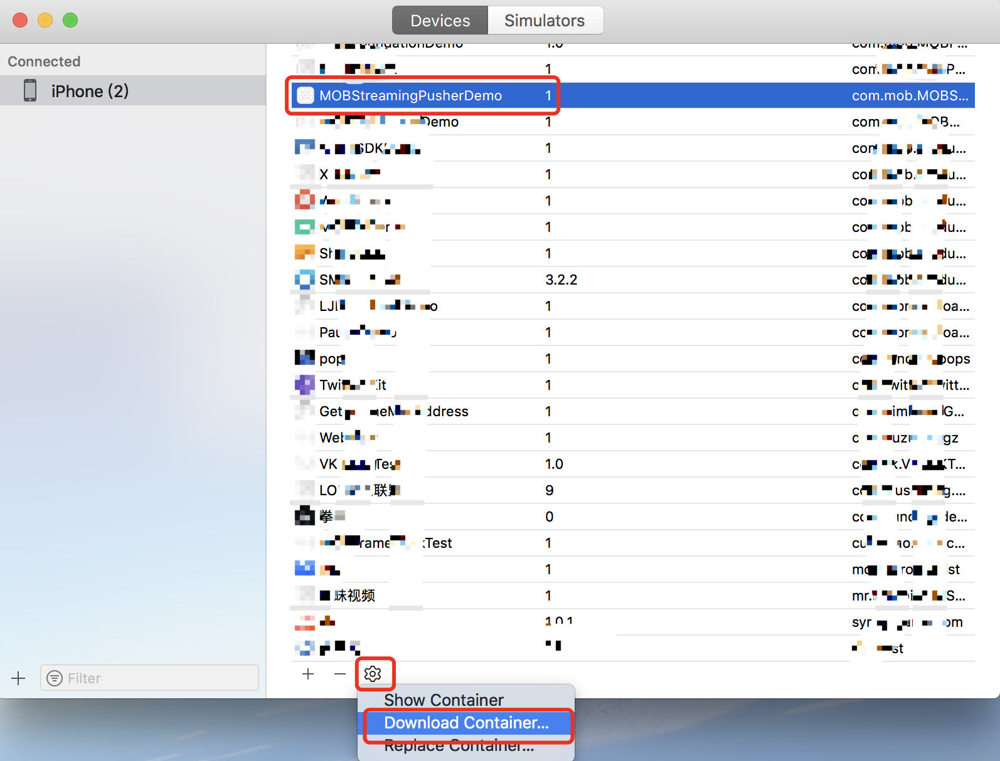
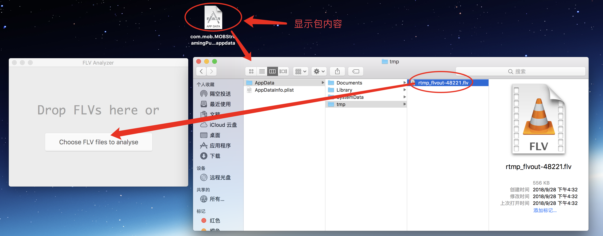
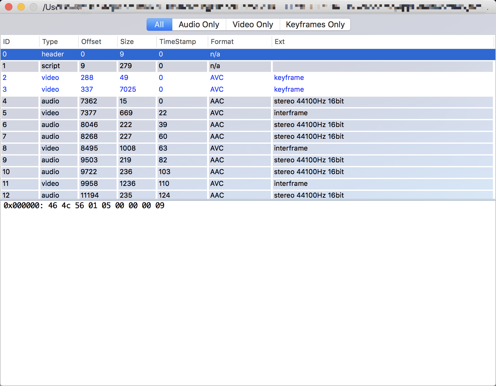
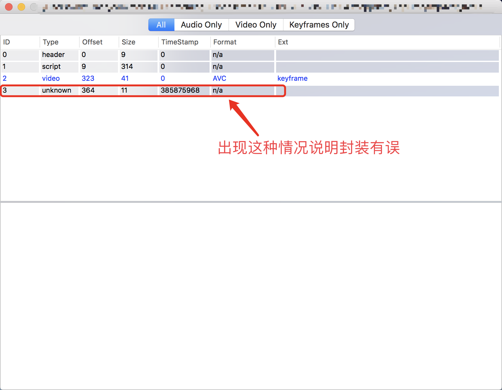

###四、服务端搭建
**mac下安装nginx加rtmp模块**  
1.下载[nginx](http://nginx.org/en/download.html)建议去官网下，同时不要下最新。  
2.下载[nginx-rtmp-module](https://github.com/arut/nginx-rtmp-module.git) 这个git上下载  
3.下载[openssl](https://www.openssl.org/source/)，笔者在安装nginx时提示需要openssl  
4.接下来就是安装，cd 下载的nginx目录下 接着

```
./configure --with-openssl=openssl的目录 --add-module=nginx-rtmp-module的目录 
```

5.make  
6.make install 这里可能会报错写入失败 权限不够 加上sudo，sudo make install   
>如果在第5步出现编译通不过，由于openssl默认是32位  
>解决办法如下：顺便给个[链接](https://www.cnblogs.com/powerthink/p/5437374.html)  
>在第4步后，在nginx文件目录里objs文件夹下Makefile文件  
>找到./config --prefix=  
>把./config改成./Configure darwin64-x86_64-cc 其他后面参数不变，保存  
>然后在执行第5步make

7.安装完成后配置相关环境  usr/local/nginx/conf/nginx.conf  
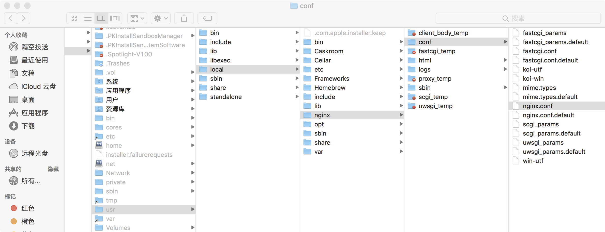

8.http服务填未被占用的端口号    
重启 sudo /usr/local/nginx/sbin/nginx -s reload,本地浏览器就能访问了   
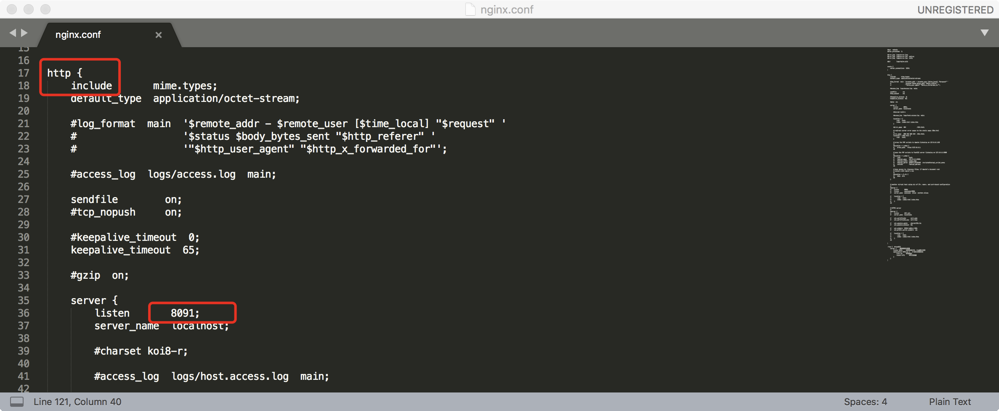
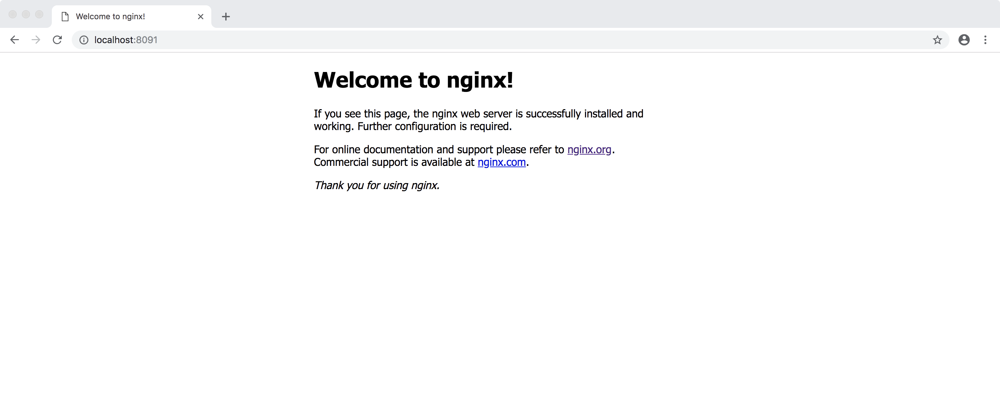

9.配置rtmp环境，配置好后，重启 sudo /usr/local/nginx/sbin/nginx -s reload  

 ```
 rtmp {  #rtmp协议
    server {    #服务器相关配置
        listen 1935;    #监听的端口号, rtmp默认1935
        application MSPLive {   # 自定义的路径名
            live on;    #开启实时
            record off;     #不记录数据
        }
    }
}
 ```

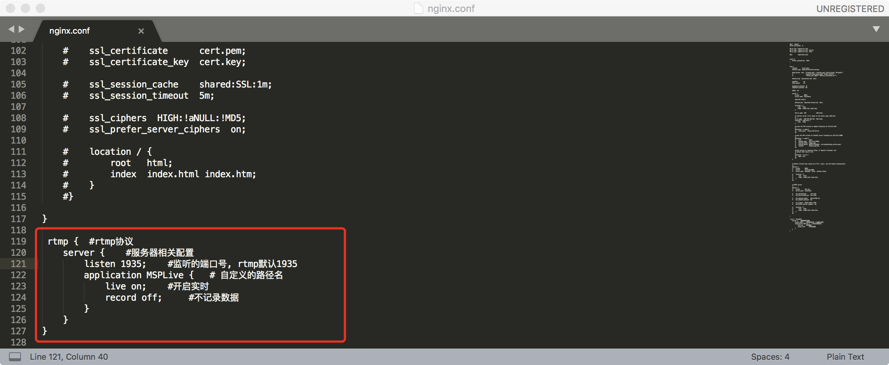

10.关闭nginx服务 sudo /usr/local/nginx/sbin/nginx -s stop  


###五、播放端
播放端采用ijkplayer架构，不做详细讨论  
ijkplayer:是基于FFmpeg的跨平台播放器架构，由B站开发，目前已被多个主流直播App集成使用。[github下载地址](https://github.com/Bilibili/ijkplayer)

